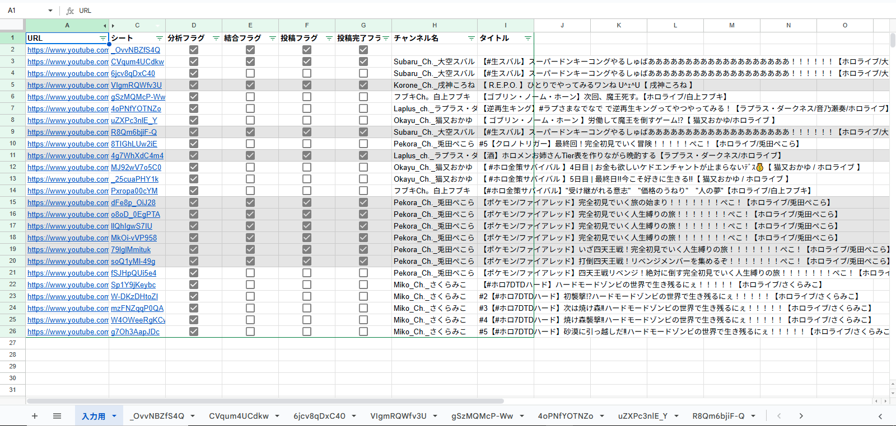
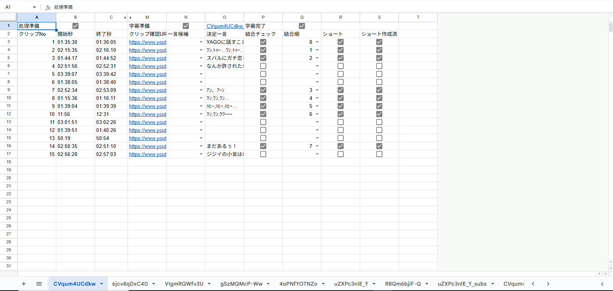
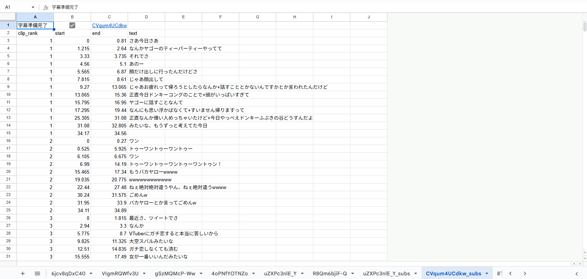
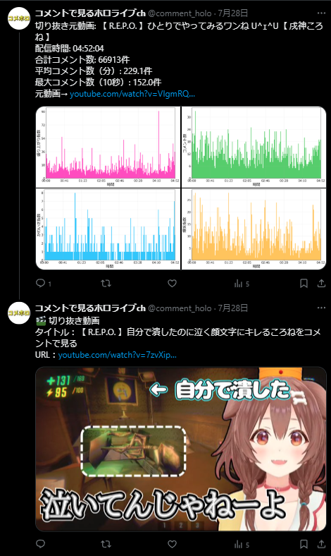

# youtube-clipper

## プロジェクト概要
YouTube配信動画からクリップ（切り抜き）を効率的に作成・投稿できる自動化ツールです。Googleスプレッドシートと連携し、配信URLの分析からクリップ選定、字幕生成・修正、動画結合、YouTube・Twitterへの自動投稿まで、クリップ作成の一連の流れを大幅に効率化します。

## 利用フロー
1. スプレッドシートに配信URLを入力（手動）
2. `analyze_pending_videos.py`で動画・コメントを自動分析（自動化）
3. スプレッドシートでクリップ候補を選定（手動）
4. `create_clip_subs.py`でWhisperによる自動字幕生成（自動化）
5. スプレッドシートで字幕を手動修正（効率化）
6. `combine_ready_clips.py`でクリップ動画を自動生成・結合（自動化）
7. `auto_upload_select.py`でYouTubeに自動予約投稿（自動化）
8. `auto_tweet.py`でTwitterに自動ツイート（自動化）

## 主な機能
- Whisperによる自動字幕生成
- Googleスプレッドシート連携（クリップ選定・字幕修正）
- クリップ動画の自動生成・結合
- YouTubeへの自動予約投稿
- Twitterへの自動告知ツイート

## 技術スタック
- Python（gspread, tweepy, Google API, etc.）
- Whisper（自動字幕生成）
- Google Sheets API
- ffmpeg（動画処理）
- YouTube Data API
- Twitter API

## 工夫点・独自性
- 字幕の自動生成＋スプレッドシート上での手動修正が容易
- クリップ選定から投稿・告知まで全工程をスクリプトで自動化
- SNS連携（YouTube/Twitter）による一括運用
- スプレッドシートをUI代わりに活用し、非エンジニアでも運用可能

## セットアップ・実行方法
1. Python仮想環境を作成し、`requirements.txt`で依存パッケージをインストール
2. `.env`ファイルを`.env.example`からコピーし、Google/Twitter APIキー等を各自で設定
3. `service_account.json`や`client_secrets.json`等の秘密情報は**絶対に公開しないでください**（`.gitignore`で除外済み）
4. スプレッドシートのテンプレートは希望者に個別提供可能です（サンプルデータは画像で出力例を示しています）
5. 各スクリプトをREADME記載の手順に沿って実行

## 秘密情報・環境変数の管理について
- 認証情報やAPIキーは`.env`ファイルで管理し、`config.py`から環境変数経由で読み込む設計です
- `.env.example`を参考に、必要な変数を各自で設定してください
- `.env`や認証ファイルは**絶対にGit等で公開しないでください**

## サンプルデータ・出力例について
- 実際の出力例はREADME内の画像で示しています
- サンプルデータ（スプレッドシートやTXT/JSON）が必要な場合はご連絡ください

---

ご質問・ご要望があればお気軽にどうぞ。
